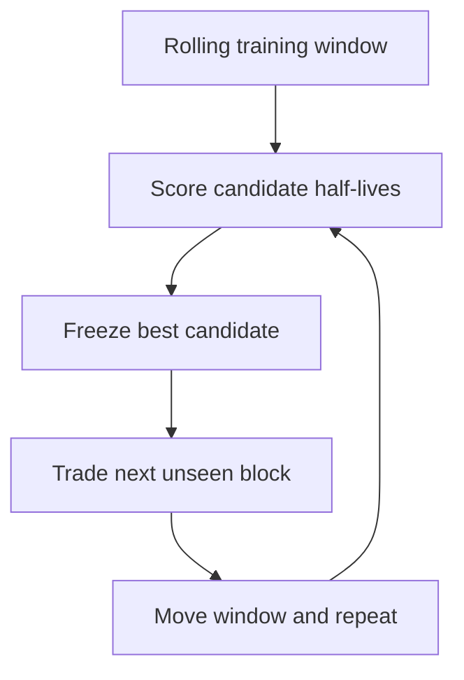

# Adaptive Markets Lab

[](https://github.com/erenduysak08-max/adaptive-markets-lab/actions/workflows/ci.yml)
[](https://www.python.org/)
[](LICENSE)

> Markets change. How quickly should a quantitative model forget the past?

Adaptive Markets Lab is a small, reproducible platform for testing adaptive
momentum and rolling-beta pairs strategies. It asks whether changing a model's
memory improves genuinely unseen performance and whether deviations between two
related assets subsequently converge.

The focus is research process rather than a profitable-trading claim: temporal
train/test separation, lagged execution, costs, identical evaluation windows,
parameter sensitivity and an auditable record of every model choice.

## Try it in under two minutes

The default demo is deterministic and offline, so it works without an API key or
market-data connection.

```bash
git clone https://github.com/erenduysak08-max/adaptive-markets-lab.git
cd adaptive-markets-lab
python -m venv .venv
```

Activate the environment:

```bash
# Windows
.venv\Scripts\activate

# macOS / Linux
source .venv/bin/activate
```

Install and run the complete study:

```bash
python -m pip install -e ".[app]"
aml-research --demo
streamlit run app.py
```

The default command runs adaptive momentum and writes seven inspectable CSV
tables to `results/latest/`. The final command opens the interactive dashboard,
where either strategy can be selected.

Docker is also supported:

```bash
docker build -t adaptive-markets-lab .
docker run --rm -p 8501:8501 adaptive-markets-lab
```

Then visit `http://localhost:8501`.

## Research design

### Adaptive momentum



For every fold, the engine:

1. Uses the preceding 504 observations as training data.
2. Backtests candidate half-lives of 5, 10, 20, 40 and 80 days.
3. Selects the highest training Sharpe ratio, with deterministic tie-breaking.
4. Freezes that choice for the next 63 unseen observations.
5. Repeats, then joins only the test blocks into the reported adaptive result.

Signals observed at close $t$ become positions for the return from $t$ to
$t+1$. Position changes pay configurable turnover-based transaction costs. The
adaptive model, a predeclared fixed 20-day model and buy-and-hold are all scored
on exactly the same out-of-sample dates.

The committed [offline demo results](results/demo/comparison.csv) deliberately
show that adaptation is not guaranteed to win. That synthetic run exists to
prove the pipeline can be reproduced without network access; it is not evidence
about real markets.

The committed [pairs demo](results/pairs_demo/comparison.csv) uses a synthetic
spread designed to mean-revert. Its purpose is also reproducibility and engine
inspection, not a profitability claim.

See [Methodology and assumptions](docs/METHODOLOGY.md) for the equations,
timeline and design decisions.

### Rolling-beta pairs trading

For each date, the pairs engine regresses the first trailing log-price series on
the second with an intercept. It standardises the newest regression residual,
opens a relative-value position when that residual exceeds the entry z-score and
closes after convergence through the exit threshold.

Traditional long-short weights are normalised to a configurable gross leverage.
The separate spot preset never shorts: it rotates into the relatively
undervalued asset and is explicitly labelled as long-only rather than
market-neutral. Both versions shift signals by one observation and charge costs
on turnover across both legs.

## Run a real-data experiment

Yahoo Finance adjusted closing prices can be downloaded through the CLI:

```bash
aml-research \
  --ticker SPY \
  --start 2010-01-01 \
  --end 2026-01-01 \
  --half-lives 5,10,20,40,80 \
  --train-periods 504 \
  --test-periods 63 \
  --cost-bps 5 \
  --output results/spy
```

An explicitly short-enabled experiment is separate:

```bash
aml-research --ticker SPY --mode long_short --leverage 2
```

A real-data pairs experiment uses two tickers:

```bash
aml-research \
  --strategy pairs \
  --ticker KO \
  --ticker-b PEP \
  --pair-lookback 60 \
  --entry-z 2.0 \
  --exit-z 0.5 \
  --mode long_short \
  --cost-bps 5 \
  --output results/ko-pep
```

An offline pairs smoke run requires no network:

```bash
aml-research --strategy pairs --demo --output results/pairs-latest
```

`spot_long_only` restricts positions to cash or a fully funded long position. It
does not make a religious ruling; asset selection and the broader strategy still
require separate Sharia screening.

## What the dashboard exposes

- Adaptive momentum or rolling-beta pairs trading
- Offline synthetic data, one live ticker or a live ticker pair
- Candidate memory lengths, regression windows and entry/exit thresholds
- Transaction costs, fixed benchmark and trading constraints
- Out-of-sample metrics and comparable growth curves
- Selected half-life through time and the complete fold audit trail
- Invested, short and out-of-market timelines with exact portfolio weights
- Two-variable colour-scale tables for parameter combinations
- Information tooltips beside every numerical model control
- The actual imported Python functions behind the selected strategy
- Fixed-parameter sensitivity and rolling-regression diagnostics
- Moving-block bootstrap intervals for mean return differences

Overview, performance, exposure, heatmap, diagnostics, code and methodology are
separated into tabs. The interface calls the same independent engine tested by
the CLI; research logic is not duplicated inside the UI.

## Evidence of correctness

| Risk | Treatment |
|---|---|
| Look-ahead bias | Target positions are shifted before returns are earned |
| Train/test leakage | Every selection ends before its test block begins |
| Hidden future dependency | A test mutates future prices and proves earlier outputs are unchanged |
| Ignored trading friction | Costs equal absolute position turnover times basis-point cost |
| Hidden pairs leverage | Both leg weights are normalised and tested against gross leverage |
| Mislabelled halal preset | Spot pair mode is labelled long-only rotation, not market-neutral pairs trading |
| Unfair comparison | All models use the identical unseen index |
| Cherry-picked parameter | Fixed benchmark is declared before evaluation; full sensitivity is shown separately |
| Misleading heatmap | Every cell is a separate rerun on one common evaluation window |
| Unreproducible demo | Seeded regime data and diffable CSV outputs are committed |
| Overconfident point estimate | Circular block bootstrap preserves short-run return dependence |

Run all checks:

```bash
python -m pip install -e ".[dev]"
ruff check .
pytest -q
```

GitHub Actions repeats the tests and an end-to-end CLI smoke run on Python 3.10
and 3.12 after every push.

## Repository structure

```text
adaptive-markets-lab/
├── app.py                         # Streamlit research interface
├── src/adaptive_markets_lab/
│   ├── backtest.py                # Lagged, costed fixed-model engine
│   ├── walk_forward.py            # Past-only rolling model selection
│   ├── research.py                # Baselines, sensitivity and regimes
│   ├── momentum.py                # EWMA score and constrained signals
│   ├── pairs.py                   # Rolling OLS, z-score states and pair weights
│   ├── sensitivity.py             # Two-variable performance surfaces
│   ├── metrics.py                 # Statistics and bootstrap uncertainty
│   ├── data.py                    # Yahoo and deterministic demo data
│   ├── config.py                  # Validated experiment definitions
│   └── cli.py                     # Reproducible command-line workflow
├── tests/                         # Timing, leakage and integration tests
├── results/demo/                  # Committed offline reference outputs
└── docs/METHODOLOGY.md            # Equations, assumptions and limitations
```

## Limitations

This is a daily close-to-close educational study, not a production execution
system. It currently studies one asset or one pair at a time and omits intraday fills,
bid-ask spread dynamics, market impact, financing, borrow availability, taxes
and portfolio-level risk allocation. Yahoo Finance is convenient but is not an
institutional point-in-time database. Sharpe ratios are descriptive and use a
zero risk-free rate. Block-bootstrap intervals quantify uncertainty in mean
return differences, but do not remove data-mining risk or establish future
profitability.

Those limits are intentional and explicit: a narrow experiment whose timing can
be audited is more useful than a large dashboard built on an invalid backtest.

## CV-ready description

> Built a Python research platform for walk-forward adaptive momentum and
> rolling-beta pairs trading; incorporated lagged execution, two-leg turnover
> costs, leverage and long-only constraints, block-bootstrap uncertainty,
> two-parameter performance surfaces and future-mutation leakage tests, with a
> reproducible CLI and tabbed Streamlit dashboard.

MIT licensed. Contributions and methodological critiques are welcome.
